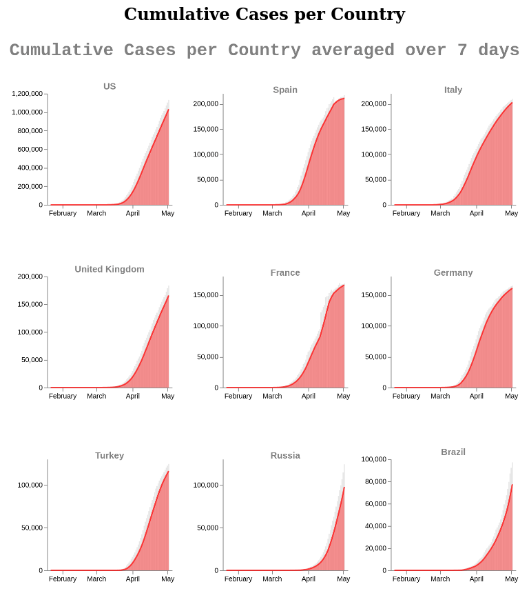
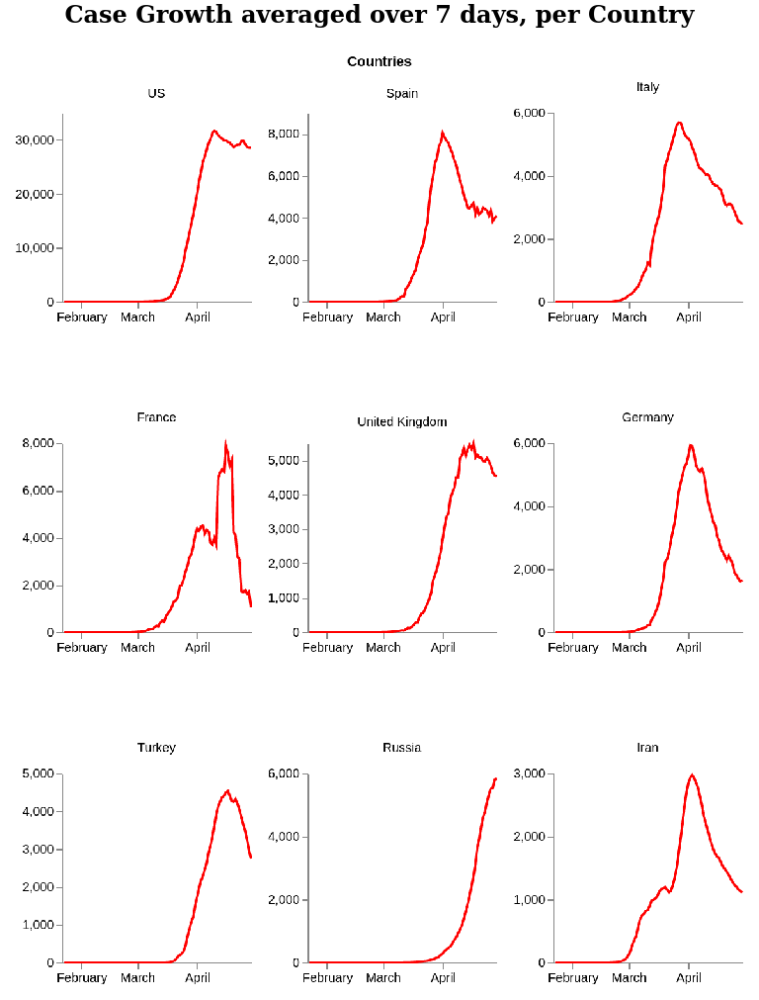

# COVID-19 Visualizations

A humble attempt to get professional looking graphs as showcased by New York Times using Python and open source libraries like Altair

**SVG plots are available too, contact me should you need them right away**

## Screenshots
#### Cumulative cases

#### Case Growth

### TODO

- GIS plots
- Logarithmic Plots